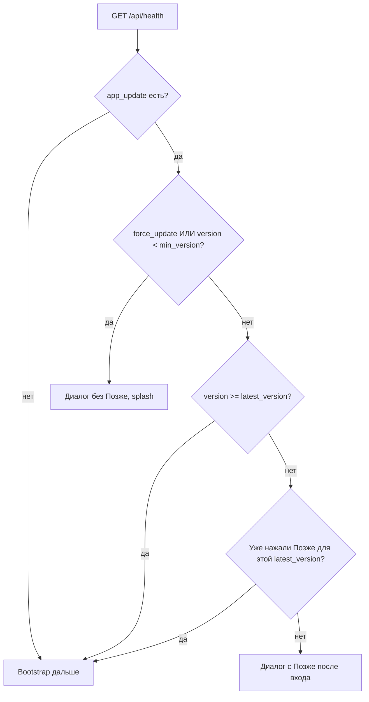

# Мобильное приложение «Колледж ДГУ»: health и обновления

Документ для команды **dgu_mobile** (Flutter). Бэкенд: `college_site`, контракт **2026-05**.

См. также: [MOBILE_HEALTH_APP_UPDATE.md](./MOBILE_HEALTH_APP_UPDATE.md) (заметки для бэкенда в репозитории мобилки).

---

## Когда вызывать

Один раз при старте на **bootstrap** (до логина, до гостевого режима).

Базовый URL API — тот же, что для остальных запросов (production: `https://college.dgu.ru/api`).

---

## Запрос

```http
GET /api/health?app_version=1.1.0&platform=android&device_model=...
```

| Параметр | Откуда взять | Пример |
|----------|----------------|--------|
| `app_version` | `PackageInfo.version` без номера сборки (`1.1.0`, не `+27`) | `1.1.0` |
| `platform` | `android`, `ios`, `windows`, `linux`, `macos`, `web` | `android` |
| `device_model` | Человекочитаемая строка (модель + ОС), URL-encode | `Samsung SM-G991B · Android 14` |

Опционально дублировать в заголовках (для прокси/логов на сервере):

- `X-App-Version`
- `X-App-Platform`
- `X-Device-Model`

**Authorization не нужен.**

---

## Ответ

Всегда ожидайте **HTTP 200** для нормальной работы API (даже если обновления нет).  
**503** — только если Postgres недоступен (`status: "degraded"`). На старте приложение **не должно падать** из‑за отсутствия `app_update`.

### Минимум (всё актуально)

```json
{
  "status": "ok",
  "server_time": "2026-06-03T14:30:00+03:00"
}
```

### Опциональное обновление

Блок `app_update` присутствует. Пользователь может **«Позже»** — клиент запоминает `latest_version` и не показывает диалог снова, пока сервер не поднимет версию.

```json
{
  "status": "ok",
  "server_time": "2026-06-03T14:30:00+03:00",
  "app_update": {
    "update_available": true,
    "force_update": false,
    "latest_version": "1.2.0",
    "title": "Доступно обновление",
    "message": "Исправлены оценки и расписание.",
    "store_url_rustore": "https://www.rustore.ru/catalog/app/...",
    "store_url_android": "https://...",
    "store_url_ios": "https://apps.apple.com/..."
  }
}
```

### Принудительное обновление

Показать блокирующий диалог **без «Позже»**, не пускать дальше bootstrap (остаться на splash).

Условия на клиенте (достаточно одного):

1. `app_update.force_update == true`
2. `app_version` строго меньше `app_update.min_version` (semver)

Пример с `min_version`:

```json
"app_update": {
  "update_available": true,
  "force_update": false,
  "min_version": "1.1.1"
}
```

При `app_version = 1.1.0` и `min_version = 1.1.1` → принудительно.

---

## Логика на клиенте



**Сравнивайте semver** `app_version`, `latest_version`, `min_version` (мажор.минор.патч).

### Открытие стора

| Платформа | URL |
|-----------|-----|
| Android | `store_url_rustore`, если пусто — `store_url_android` |
| iOS | `store_url_ios` |

Для `platform` в `windows` / `linux` / `macos` / `web` сервер **не присылает** `app_update`; клиент не показывает диалог обновления.

### Парсинг полей

Сервер отдаёт **snake_case**. Поддержите и **camelCase** на парсере, если уже есть в моделях (`updateAvailable`, `forceUpdate`, …).

Если ключа `app_update` нет — обновление не предлагать.

---

## Сценарии для QA

| `app_version` | Настройка сервера | Ожидание в UI |
|---------------|-------------------|---------------|
| 1.1.0 | `latest_version=1.2.0` | Диалог с «Позже» |
| 1.1.0 | `latest_version=1.2.0`, `min_version=1.1.1` | Принудительно |
| 1.2.0 | `latest_version=1.2.0` | Без диалога |
| 1.1.0 | `latest_version=1.2.0`, `force_update=true` | Принудительно |

Проверка на production:

```bash
curl -s "https://college.dgu.ru/api/health?app_version=1.1.0&platform=android"
```

---

## Демо / мок

При работе через демо-мок (`test@test.ru`) health может возвращать «нет обновления». Для проверки UI обновления используйте реальный API или временно измените мок в `demo_mock_responses.dart`.

---

## Реализация в репозитории

| Файл | Роль |
|------|------|
| `lib/data/api/health_api.dart` | HTTP GET |
| `lib/core/device/app_runtime_info.dart` | version / platform / device |
| `lib/core/utils/app_semver.dart` | сравнение semver |
| `lib/data/models/app_health_response.dart` | JSON → модель |
| `lib/core/update/app_update_controller.dart` | force / «Позже» |
| `lib/core/update/app_update_dialog.dart` | UI |
| `lib/app/bootstrap/bootstrap_page.dart` | вызов при старте |

---

## Версия в pubspec

После публикации сообщите колледжу **версию** из pubspec (`version: 1.2.0+…` → **1.2.0**). Администратор укажет её в админке «Мобильное приложение».

Синхронизируйте запасной fallback: `lib/core/constants/app_release_info.dart`.
