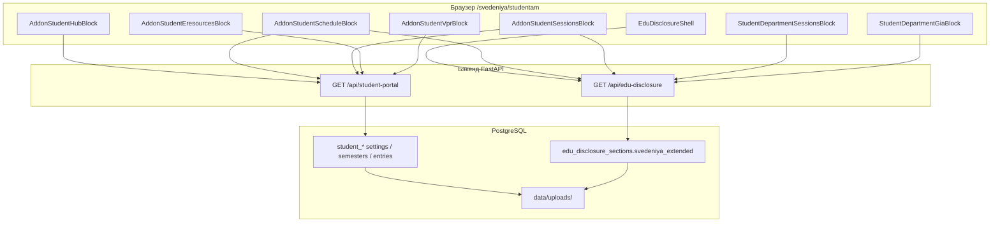

# Раздел «Студентам» в сведениях об ОО — откуда берутся данные

Документ описывает, **как публичный сайт** (`/svedeniya/studentam/...`) получает контент с бэкенда.  
Это **не** интеграция с 1С: расписание здесь — **PDF-сканы**, загруженные в админке. Живое расписание из 1С используется в **личном кабинете / мобильном приложении** (`GET /api/1c/schedule` и др.).

---

## Схема данных



**Два источника:**

| API | Когда вызывается | Что даёт для «Студентам» |
|-----|------------------|---------------------------|
| `GET /api/edu-disclosure` | Один раз при входе в любую страницу `/svedeniya/...` (контекст layout) | JSON `svedeniya_extended`: сессии и ГИА **по отделениям** |
| `GET /api/student-portal` | На каждой странице подраздела «Студентам» (отдельный `fetch` в компонентах) | Обзор, hub-ссылки, PDF по семестрам, ВПР, электронные ресурсы, сессии |

Авторизация для публичных запросов **не нужна**.

---

## URL на сайте и вкладки меню

Навигация задаётся в `frontend/src/lib/eduDisclosureNav.ts`. Подраздел «Студентам» (`segment: studentam`):

| Вкладка в UI | URL | Компонент фронта |
|--------------|-----|------------------|
| Общая информация | `/svedeniya/studentam/razdel` | `AddonStudentHubBlock` |
| Расписание занятий | `/svedeniya/studentam/raspisanie-zanyatiy` | `AddonStudentScheduleBlock` + `StudentDepartmentGiaBlock` |
| Расписание сессий | `/svedeniya/studentam/raspisanie-sessiy` | `AddonStudentSessionsBlock` + `StudentDepartmentGiaBlock` |
| Электронные ресурсы | `/svedeniya/studentam/elektronnye-resursy` | `AddonStudentEresourcesBlock` |
| ВПР | `/svedeniya/studentam/vpr` | `AddonStudentVprBlock` |
| СНО | `/svedeniya/studentam/sno` | **Редирект** (не API), см. ниже |

Роутинг страниц: `frontend/src/components/svedeniya/SvedeniyaSectionBody.tsx` (`pathKey === "studentam/..."`).

Устаревший путь `/svedeniya/studentam/sessii-po-otdeleniyam` перенаправляется на `raspisanie-sessiy`.

---

## 1. `GET /api/student-portal`

**Роутер:** `backend/routers/student_portal.py`  
**Сборка ответа:** `build_student_portal_public(db)`  
**Тип ответа:** `StudentPortalPublicOut` (`backend/schemas.py`)

### Пример запроса

```http
GET /api/student-portal
Cache-Control: no-store
```

Фронт: `SvedeniyaAddonSections.tsx` → хук `useStudentPortalPayload()`:

```ts
fetch(`${API_BASE}/api/student-portal`, { cache: "no-store" })
```

### Структура ответа

```json
{
  "schedule_semesters": [
    {
      "id": 1,
      "title": "2 СЕМЕСТР 2025-2026 ГОД.",
      "sort_order": 0,
      "entries": [
        {
          "id": 10,
          "label": "Информационные системы и программирование",
          "file_url": "/uploads/student_portal/abc.pdf",
          "original_filename": "isp.pdf",
          "file_size": 1234567
        }
      ]
    }
  ],
  "schedule_page": { "body_html": "<p>...</p>" },
  "overview": {
    "body_html": "<p>Общая информация...</p>",
    "hub_links": [
      { "label": "Расписание занятий", "href": "/svedeniya/studentam/raspisanie-zanyatiy", "external": false },
      { "label": "СНО", "href": "https://sno.dgu.ru/", "external": true }
    ]
  },
  "vpr": {
    "page_title": "ВПР",
    "body_html": "<p>...</p>",
    "file_url": "/uploads/student_portal/vpr.pdf",
    "original_filename": null,
    "file_size": null
  },
  "eresources": { "body_html": "<p>...</p>" },
  "sessions": { "body_html": "<p>...</p>" },
  "sessions_semesters": []
}
```

### Какой подраздел что читает

| Подраздел на сайте | Поля из ответа | Логика на фронте |
|--------------------|----------------|------------------|
| **Общая информация** (`razdel`) | `overview.body_html`, `overview.hub_links` | Блок «Общая информация» — HTML. Блок «Разделы» — список ссылок (как на скриншоте с «Расписание занятий», «СНО» и т.д.). Если `hub_links` пуст — подставляется `DEFAULT_STUDENT_HUB_LINKS` из `frontend/src/lib/studentPortalTypes.ts`. Ссылки с `sessii-po-otdeleniyam` отфильтровываются. |
| **Расписание занятий** | `schedule_page.body_html`, `schedule_semesters[]` | Если в `schedule_page.body_html` есть видимый текст (функция `studentPortalHtmlOverridesPdfGrid`) — показывается **только HTML**. Иначе — карточки семестров: заголовок `title`, список направлений `entries[].label` → ссылка на PDF `entries[].file_url`. |
| **Расписание сессий** | `sessions.body_html`, `sessions_semesters[]` | Та же схема, что для занятий. Дополнительно ниже — блок из `edu-disclosure` (сессии по отделениям). |
| **Электронные ресурсы** | `eresources.body_html` | Только HTML; пустая страница не рендерится. |
| **ВПР** | `vpr.page_title`, `vpr.body_html`, `vpr.file_url` | Заголовок, текст, опционально кнопка «Открыть PDF». |

### Публикация (видимость)

В БД таблица `student_portal_visibility` (одна строка `id=1`). Если флаг `false`, API **обрезает** контент:

| Флаг | Эффект |
|------|--------|
| `overview_published` | Пустые `overview.body_html` и `hub_links` |
| `schedule_published` | Пустые `schedule_semesters`, пустой `schedule_page.body_html` |
| `sessions_published` | Пустые `sessions_semesters`, пустой `sessions.body_html` |
| `vpr_published` | Пустые `vpr.body_html`, `file_url` |
| `eresources_published` | Пустой `eresources.body_html` |

Управление: админка → **PUT** `/api/student-portal/admin/visibility`.

### Таблицы БД (портал «Студентам»)

| Таблица | Назначение |
|---------|------------|
| `student_overview_settings` | `body_html`, `hub_links_json` |
| `student_schedule_page_settings` | HTML над PDF-расписанием занятий |
| `student_schedule_semester` / `student_schedule_entry` | Семестр + PDF по направлениям (занятия) |
| `student_sessions_settings` | HTML для страницы сессий |
| `student_sessions_semester` / `student_sessions_entry` | Семестр + PDF (сессии) |
| `student_vpr_settings` | ВПР: заголовок, HTML, PDF |
| `student_eresources_settings` | Электронные ресурсы (HTML) |
| `student_portal_visibility` | Флаги публикации |
| `student_portal_archive` | Архив учебного года (только админ) |

Файлы PDF: `data/uploads/student_portal/{uuid}_{имя}.pdf` → в API поле `file_url` вида `/uploads/student_portal/...`.

---

## 2. `GET /api/edu-disclosure` (блоки по отделениям)

**Роутер:** `backend/routers/edu_disclosure.py`  
**Поле в ответе:** `svedeniya_extended` (JSON из `edu_disclosure_sections`, ключ `svedeniya_extended`)

Фронт: `EduDisclosureShell.tsx` → один раз `GET /api/edu-disclosure`, далее `useEduDisclosure()` в дочерних компонентах.

### Поля для «Студентам»

| Поле в `svedeniya_extended` | Где на сайте | Содержимое |
|-----------------------------|--------------|------------|
| `studentam_sessions_block_title` | Страница **Расписание сессий** (нижний блок) | Заголовок, по умолчанию «Расписание сессии и пересдачи по отделениям» |
| `studentam_department_sessions[]` | Там же | Массив по отделениям: `ones_id`, `name`, подразделы `exam_session`, `retake`, `commission` — у каждого `title`, `body_html`, `pdfs[]` |
| `studentam_gia_block_title` | **Расписание занятий** и **Расписание сессий** (блок ГИА) | По умолчанию «Государственная итоговая аттестация (ГИА)» |
| `studentam_department_gia[]` | Там же | По отделению: `demo_exam`, `defense` — те же поля `title`, `body_html`, `pdfs[]` |

Компоненты:

- `StudentDepartmentSessionsBlock.tsx` — выпадающий список «Отделение / направление», три подраздела с PDF и HTML.
- `StudentDepartmentGiaBlock.tsx` — ГИА: демоэкзамен и защита ВКР (`DepartmentSubsectionsPublicBlock`).

PDF из `pdfs[].file_rel` отдаются как `/uploads/edu_disclosure/...` (функция `eduUploadsFileUrl`).

### Редактирование в админке

- **Сведения об ОО** → расширенные настройки (`svedeniya_extended`): вкладки «Расписание сессий» / ГИА по отделениям (`DepartmentSessionsFromEduDisclosure`, `DepartmentGiaFromEduDisclosure` в `admin/edu-disclosure`).
- Справочник отделений для подписей: **GET** `/api/admin/department-catalog` (синхронизация с 1С для списка `ones_id` / `name`).

---

## 3. СНО — без API

URL `/svedeniya/studentam/sno` **не грузит** `student-portal`.

Редирект в `frontend/next.config.ts`:

- источник: `/svedeniya/studentam/sno`
- назначение: `NEXT_PUBLIC_STUDENT_SNO_URL` или `https://sno.dgu.ru/`

В hub-ссылках СНО часто помечена как `external: true`.

---

## Админка (редактирование контента)

| Что редактируют | URL админки | API |
|-----------------|-------------|-----|
| Обзор, hub-ссылки, PDF семестров, ВПР, ресурсы, сессии, видимость | `/staff/college/college-admin/admin/student-portal` | `GET/PUT /api/student-portal/admin/...` |
| Сессии/ГИА по отделениям | `/staff/college/college-admin/admin/edu-disclosure` | `PUT /api/edu-disclosure/admin/sections/svedeniya_extended` |
| Загрузка PDF (портал) | та же student-portal | `POST /api/student-portal/admin/upload` → `uploads/student_portal/` |
| Загрузка PDF (сведения) | edu-disclosure | `POST /api/edu-disclosure/admin/upload` → `uploads/edu_disclosure/` |

Основные админ-эндпоинты портала (`backend/routers/student_portal.py`):

| Метод | Путь | Назначение |
|-------|------|------------|
| GET | `/api/student-portal/admin/snapshot` | Всё состояние для редактора |
| PUT | `/api/student-portal/admin/overview` | Общая информация + hub_links |
| PUT | `/api/student-portal/admin/schedule-page` | HTML страницы «Расписание занятий» |
| POST/PUT/DELETE | `/api/student-portal/admin/schedule-semesters`, `schedule-entries` | Семестры и PDF занятий |
| PUT | `/api/student-portal/admin/sessions` | HTML страницы сессий |
| POST/PUT/DELETE | `/api/student-portal/admin/sessions-semesters`, `sessions-entries` | Семестры и PDF сессий |
| PUT | `/api/student-portal/admin/vpr` | ВПР |
| PUT | `/api/student-portal/admin/eresources` | Электронные ресурсы |
| PUT | `/api/student-portal/admin/visibility` | Вкл/выкл подразделов на сайте |
| POST | `/api/student-portal/admin/archives` | Архив учебного года |

Роли: `admin`, `event_manager`, `methodist`.

---

## Соответствие скриншотам UI

**Страница «Общая информация»** (`razdel`):

- Вкладки сверху — статическая навигация из `eduDisclosureNav.ts` (не из API).
- «Общая информация» + «Разделы» — из `GET /api/student-portal` → `overview`.

**Страница «Расписание занятий»**:

- Семестр «2 СЕМЕСТР 2025-2026 ГОД.» и список направлений с PDF — `schedule_semesters` из `student-portal`.
- Блок «Государственная итоговая аттестация (ГИА)» с выбором направления — `studentam_department_gia` из `edu-disclosure`.

---

## Отличие от мобильного приложения / 1С

| Контекст | API | Данные |
|----------|-----|--------|
| Сведения об ОО на сайте | `student-portal`, `edu-disclosure` | PDF и HTML из админки, PostgreSQL |
| ЛК студента / приложение | `GET /api/1c/schedule`, `my-profile`, `sync-grades`, … | Живые данные из 1С (нужен параметр `fio` + зачётка) |

Публичный раздел «Студентам» **не вызывает** `GET /api/1c/*`.

---

## Связанные файлы в репозитории

| Слой | Файлы |
|------|--------|
| Бэкенд API | `backend/routers/student_portal.py`, `backend/routers/edu_disclosure.py` |
| Схемы | `backend/schemas.py` (`StudentPortalPublicOut`, …) |
| Модели БД | `backend/models.py` (`StudentScheduleSemester`, `StudentOverviewSettings`, …) |
| Фронт сведений | `frontend/src/components/svedeniya/SvedeniyaAddonSections.tsx`, `StudentDepartmentSessionsBlock.tsx`, `StudentDepartmentGiaBlock.tsx` |
| Типы | `frontend/src/lib/studentPortalTypes.ts`, `frontend/src/lib/svedeniyaExtended.ts` |
| Навигация | `frontend/src/lib/eduDisclosureNav.ts` |

Общий обзор всех сведений: [SVEDENIYA_OO_FULL.md](./SVEDENIYA_OO_FULL.md) (раздел 15). Аудит для мобилки: [SVEDENIYA_OO_MOBILE_AUDIT.md](./SVEDENIYA_OO_MOBILE_AUDIT.md).
